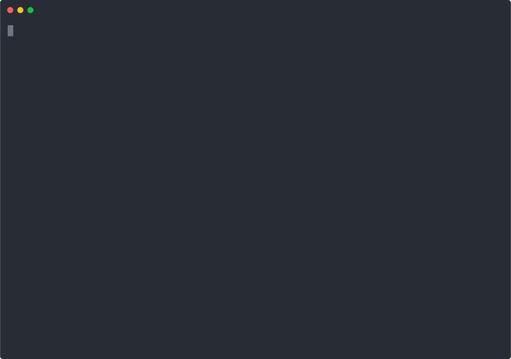

## Help

For help on any subcommands, use the `-h` flag.

```bash title="terminal"
$ threatcl
Usage: threatcl [--version] [--help] <command> [<args>]

Available commands are:
    dashboard    Generate markdown files from existing HCL threatmodel file(s)
    dfd          Generate Data Flow Diagram PNG or DOT files from existing HCL threatmodel file(s)
    export       Export threat models into other formats
    generate     Generate an HCL Threat Model
    list         List Threatmodels found in HCL file(s)
    terraform    Parse output from 'terraform show -json'
    validate     Validate existing HCL Threatmodel file(s)
    view         View existing HCL Threatmodel file(s)
```

### Arguments

`threatcl` uses the typical argument style used by Hashicorp tools, that is a single `-` (instead of `--`). 

Most arguments can accept a value, in the style of `-argument=value` or `-argument value`.

For boolean arguments, you typically set them by simply adding the `-argument` to the command.

### Optional Config File

Most of the `threatcl` commands have a `-config` flag that allows you to specify a `config.hcl` file. HCL within this file may be used to overwrite some of `threatcl`'s default attributes. These are listed below:

* **Initiative Sizes** - defaults to "Undefined", "Small", "Medium", "Large"
* **Default Initiative Size** - defaults to "Undefined
* **Information Classifications** - defaults to "Restricted", "Confidential", "Public"
* **Default Information Classification** - defaults to "Confidential"
* **Impact Types** - defaults to "Confidentiality", "Integrity", "Availability"
* **STRIDE Elements** - defaults to "Spoofing", "Tampering", "Info Disclosure", "Denial Of Service", "Elevation Of Privilege"
* **Uptime Dependency Classifications** - defaults to "none", "degraded", "hard", "operational"
* **Default Uptime Depency Classification** - defaults to "none"

For example:

```hcl
initiative_sizes = ["S", "M", "L"]
default_initiative_size = "M"
info_classifications = ["1", "2"]
default_info_classification = "1"
impact_types = ["big", "small"]
strides = ["S", "T"]
uptime_dep_classifications = ["N", "D"]
default_uptime_dep_classification = "N"
```

If you modify these attributes, you'll need to remember to provide the config file for other operations, as this may impact validation or dashboard creation.

## Commands

These are the main sub-commands available to `threatcl`

### Validate

The `threatcl validate` command is used to validate a `threatcl` spec HCL file.

```bash title="terminal"
$ threatcl validate examples/*
Validated 3 threatmodels in 3 files
```

#### Validate options

If you want to pipe input into `validate` you can do so with with `-stdin` or `-stdinjson` flag. This is useful for pipelining commands together.

### List

The `threatcl list` command can be used to list threat models from a selection of hcl files.

```bash title="terminal"
$ threatcl list examples/*
#  File              Threatmodel      Author
1  examples/tm1.hcl  Tower of London  @xntrik
2  examples/tm1.hcl  Fort Knox        @xntrik
3  examples/tm2.hcl  Modelly model    @xntrik
```

#### List options

If you don't want to display the header, use the `-noheader` flag.

You can also adjust the available columns with `-fields` flag. For example, by providing a comma-separated list of fields:
* `number`
* `file`
* `threatmodel`
* `assetcount`
* `threatcount`
* `usecasecount`
* `tpdcount`
* `exclusioncount`
* `size`
* `internetfacing`
* `newinitiative`
* `dfd`
* `author`

By default it'll be as if you provided `-fields=number,file,threatmodel,author`

### View

The `threatcl view` command can be used to view threat models from a selection of hcl files.

```bash title="terminal"
$ threatcl view examples/tm2.hcl

  Modelly model

  Author: @xntrik

  ## Threat Scenarios

  ### Threat

  threaty threat

  │ STRIDE: Spoofing, Elevation Of Privilege

  #### Controls

  ##### Important Control

  │ Implemented: ❌

  This is a description of the control.

                   │
  ─────────────────┼─────
    Risk Reduction │ 50
```

#### View options

If you provide the `-raw` flag, then raw markdown will be returned.

### Export

The `threatcl export` command is used to export a threat model (or models) into the native JSON representation, by default. You can also export into the [OpenThreatModel](https://github.com/IriusRisk/OpenThreatModel) JSON representation.

```bash title="terminal"
$ threatcl export -format=otm examples/tm1.hcl
[{"assets":[{"description":"including the imperial state crown","id":"crown-jewels","name":"crown jewels","risk":{"availability":0,"confidentiality":0,"integrity":0}}],"mitigations":[{"attributes":{"implementation_notes":"They are trained to be guards as well","implemented":true},"description":"Lots of guards patrol the area","id":"lots-of-guards","name":"Lots of Guards","riskReduction":80}],"otmVersion":"0.2.0","project":{"attributes":{"initiative_size":"Small","internet_facing":true,"network_segment":"dmz","new_initiative":true},"description":"A historic castle","id":"tower-of-london","name":"Tower of London","owner":"@xntrik"},"threats":[{"categories":["Confidentiality"],"description":"Someone who isn't the Queen steals the crown","id":"threat-1","name":"Threat 1","risk":{"impact":0,"likelihood":null}}]},{"assets":[{"description":"Lots of gold", "id":"gold","name":"Gold","risk":{"availability":0,"confidentiality":0,"integrity":0}}],"mitigations":[{"attributes":{"implemented":true},"description":"A large wall surrounds the fort","id":"big-wall","name":"Big Wall","riskReduction":80}],"otmVersion":"0.2.0","project":{"attributes":{"initiative_size":"Small","internet_facing":true,"new_initiative": false},"description":"A .. fort?","id":"fort-knox","name":"Fort Knox","owner":"@xntrik"},"threats":[{"categories":["Confidentiality"],"description":"Someone steals the gold","id":"threat-1","name":"Threat 1","risk":{"impact":0,"likelihood":null}}]}]
```

#### Export options

- You can specify the output of the export with the `-format` flag. By default this is set to `json`, but you can also set it to `otm`.

- If you want to write to a file instead of `stdout` use the `-output` flag, for example `threatcl export -output=filename.json`. If you want to overwrite the output file, supply the `-overwrite` flag.

### Dashboard

The `threatcl dashboard` command takes `threatcl` HCL files, and generates a number of output files, and optionally PNG files, dropping them into the selected folder.

```bash title="terminal"
$ threatcl dashboard -overwrite -outdir=dashboard-example examples/*
Created the 'dashboard-example' directory
Writing dashboard markdown files to 'dashboard-example' and overwriting existing files
Successfully wrote to 'dashboard-example/tm1-toweroflondon.md'
Successfully wrote to 'dashboard-example/tm1-fortknox.md'
Successfully wrote to 'dashboard-example/tm2-modellymodel.png'
Successfully wrote to 'dashboard-example/tm2-modellymodel.md'
Successfully wrote to 'dashboard-example/dashboard.md'
```

#### Dashboard options

The `dashboard` command takes a number of options, and allows for you to customise the templates used for both the individual threat model generated files, and the associated index file.

- You must set the output folder using the `-outdir` flag. For example, `-outdir dashboard`

- By default the index file generated is `dashboard.md`. You can change the name of the file, but not its extension, with the `-dashboard-filename` flag. For example, `-dashboard-filename=index`

- If you don't want to generate and include rendered DFD files provide the `-nodfd` flag.

- By default the extension of generated files is `.md`. If you want to change this, use the `-out-ext` flag. For example, `-out-ext=html`. Don't include the leading `.`.

- If you want to overwrite the target folder provide the `-overwrite` flag.

#### Dashboard templates

You can fully customise the templates used to generate `dashboard` output. By default this uses Golang's [text/template](https://pkg.go.dev/text/template) package.

- To specify a dashboard template file, use the `-dashboard-template` flag. For an example, see [dashboard-template.tpl](https://github.com/threatcl/threatcl/blob/main/examples/dashboard-template.tpl).

- To specify a threatmodel template file, use the `-threatmodel-template` flag. For an example, see [threatmodel-template.tpl](https://github.com/threatcl/threatcl/blob/main/examples/threatmodel-template.tpl).

- You can generate HTML output instead of plaintext. To do that, ensure you use appropriate templates, and also enable (by setting) `-dashboard-html`. Don't forget to set `-out-ext=html`. This will then use Golang's [html/template](https://pkg.go.dev/html/template) package.

### Data Flow Diagram

As per the [spec](link), a `threatmodel` may include `data_flow_diagram_v2` blocks. An example of a simple DFD is available [here](link). The legacy `data_flow_diagram` blog will be deprecated at some point.

The `threatcl dfd` command takes `threatcl` HCL files, and generates a number of png files, dropping them into a selected folder.

If the HCL file doesn't include a `threatmodel` block with a `data_flow_diagram` or `data_flow_diagram_v2` block, then nothing is output.

The command is similar to the `dashboard` command.

```bash title="terminal"
$ threatcl dfd -overwrite -outdir testout examples/*
Successfully created 'testout/tm2-modellymodel.png'
```

#### Data Flow Diagram options

- You can specify the output format with the `-format` flag. By default this is set to `png`, but you can also set it to `dot` or `svg`.

- If the `-format=dot`, you can output directly to STDOUT with the `-stdout` flag.

- `-outdir` is the directory where files are written. This folder will be created if it doesn't exist. Either this, or `-out` must be set.

- `-out` is the name of a single output file. Only the first discovered DFD in all the parsed HCL files will be created. Either this or `-outdir` must be set.

- `-overwrite` flag can optionally be added to overwrite any output content.

### Terraform

The `threatcl terraform` command is able to extract data resources from the `terraform show -json` output, you can read more about that [here](https://www.terraform.io/docs/cli/commands/show.html). This includes output of plan files, or active state files. The `threatcl terraform` command will then convert these into drafted `information_asset` blocks for inclusion in a `threatcl` HCL file.

If you're in a folder with existing state, you can execute the following:

```bash title="terminal"
terraform show -json | threatcl terraform -stdin
```

This will output something similar to this:

```bash title="terminal"
information_asset "aws_rds_cluster default" {
  description                = "cluster_identifier: aurora-cluster-demo, database_name: mydb"
  information_classification = ""
  source                     = "terraform state"
}
information_asset "aws_s3_bucket example" {
  description                = "bucket: terraform-20211107232017071500000001"
  information_classification = ""
  source                     = "terraform state"
}
```

You can also see similar output from a plan file that hasn't yet been applied with Terraform by running:

```bash
terraform show -json <plan-file> | threatcl terraform -stdin
```

If you want to update an existing `threatcl` threat model file ("threatmodel.hcl") you can with:

```bash title="terminal"
terraform show -json <plan> | threatcl terraform -stdin -add-to-existing=threatmodel.hcl > new-threatmodel.hcl
```

With the `-add-to-existing` flag, you can also specify a `-tm-name=<string>` if you need to specify a particular threat model from the source file, if there are multiple. And you can also apply a default classification with the `-default-classification=Confidential` flag.

#### Terraform options

- You specify the input either as a file argument, or via the STDIN with the `-stdin` flag. 

- Specify the default information classification of generated `information_asset` blocks with the `-default-classification` flag.

- If you want to output a modified HCL `threatcl` file, you can use the `-add-to-existing=<hcl file>` flag. If set, will add the generated information_assets into the provided file. This will not overwrite the provided file, instead it'll output an adjusted HCL file to STDOUT.

- If the provided HCL file contains multiple `threatmodel` blocks, you can use the `-tm-name=<string>` flag in addition to the `-add-to-existing` flag, to specify a particular threat model.

- The terraform resources that `threatcl terraform` is aware of are hard coded in [pkg/terraform.go](https://github.com/threatcl/threatcl/blob/main/pkg/terraform/terraform.go). If you want the `threatcl terraform` command to output other `information_asset` resources that aren't provided, you can supply your own version of this json via the `-tf-collection=<json file>` flag.

### Generate

The `threatcl generate` command is used to either output a generic `boilterplate` `threatcl` spec HCL file, or, interactively ask the user questions to then output a `threatcl` spec HCL file.

#### Generate Interactive

See the following example of:

```bash title="terminal"
threatcl generate interactive
```



#### Generate Interactive Editor

If you prefer to work directly in your `$EDITOR` then run:

```bash title="terminal"
threatcl generate interactive editor
```

This will open your editor with a barebones HCL threat model. If you want to validate the model after creation, then use the `-validate` flag.
